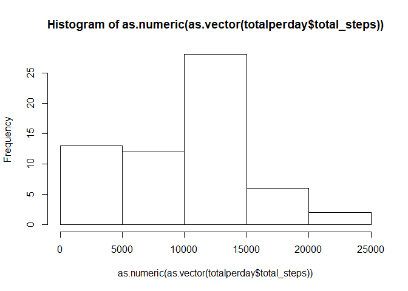
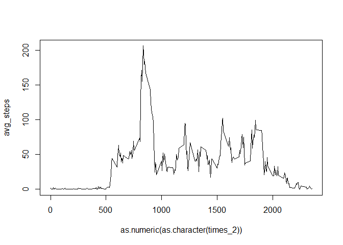
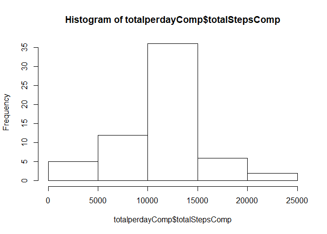
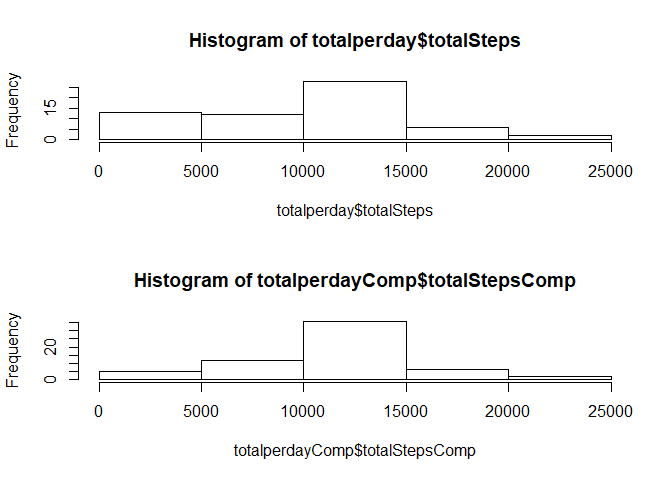
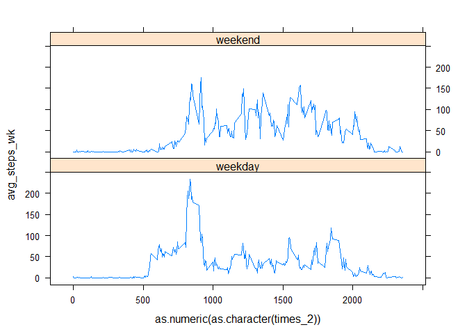

## Introduction

This is my first R Markdown document. I am going to practise using it by completing the Course Project tasks.

## Loading and pre-processing the data

### Question 1 - Load the data

First I will load the libraries that I need as well as the data.


```r
library(tidyr)
library(dplyr)
library(ggplot2)
library(lattice)

activityData <- read.csv(unz("activity.zip", "activity.csv"), sep = ",")

head(activityData)
```

```
##   steps       date interval
## 1    NA 2012-10-01        0
## 2    NA 2012-10-01        5
## 3    NA 2012-10-01       10
## 4    NA 2012-10-01       15
## 5    NA 2012-10-01       20
## 6    NA 2012-10-01       25
```

### Question 2 - Process the data into a suitable format

I have established from exploring the data that there are three columns - the first shows the number of steps taken in a 5 minute interval, the second has the date, and the third has the time. However the date and time are not in the most useful format, as can be seen from the extract below.


```r
activityData[107:112, ]
```

```
##     steps       date interval
## 107    NA 2012-10-01      850
## 108    NA 2012-10-01      855
## 109    NA 2012-10-01      900
## 110    NA 2012-10-01      905
## 111    NA 2012-10-01      910
## 112    NA 2012-10-01      915
```

It can be seen that the time goes from 855 to 900 - i.e. 8.55 to 9.00.

I will turn this into a more useful format - POSIXct. Firstly I need to manipulate the time into a format that is consistent for all times.


```r
times <- activityData[, 3]
times_2 <- c()

i <- 1

while(i <= length(times)){
  if(times[i] < 1000){
    times_2[i] <- paste("0", times[i], sep = "")
    if(times[i] < 100){
      times_2[i] <- paste("00", times[i], sep = "")
      if(times[i] < 10){
        times_2[i] <- paste("000", times[i], sep = "")
      } 
    }
  }  else
    times_2[i] <- times[i]
  i <- i + 1
}

activityData <- cbind(activityData, times_2)  

activityData[c(1, 10, 100, 1000),]
```

```
##      steps       date interval times_2
## 1       NA 2012-10-01        0    0000
## 10      NA 2012-10-01       45    0045
## 100     NA 2012-10-01      815    0815
## 1000     0 2012-10-04     1115    1115
```

Now I can change the format to POSIXct.


```r
activityData <- tbl_df(activityData)
activityData <- mutate(activityData, datetime = paste(date, times_2, sep = " "))
activityData$datetime <- as.POSIXct(activityData$datetime, format = "%Y-%m-%d %H%M")
activityData
```

```
## # A tibble: 17,568 x 5
##    steps       date interval times_2            datetime
##    <int>     <fctr>    <int>  <fctr>              <dttm>
##  1    NA 2012-10-01        0    0000 2012-10-01 00:00:00
##  2    NA 2012-10-01        5    0005 2012-10-01 00:05:00
##  3    NA 2012-10-01       10    0010 2012-10-01 00:10:00
##  4    NA 2012-10-01       15    0015 2012-10-01 00:15:00
##  5    NA 2012-10-01       20    0020 2012-10-01 00:20:00
##  6    NA 2012-10-01       25    0025 2012-10-01 00:25:00
##  7    NA 2012-10-01       30    0030 2012-10-01 00:30:00
##  8    NA 2012-10-01       35    0035 2012-10-01 00:35:00
##  9    NA 2012-10-01       40    0040 2012-10-01 00:40:00
## 10    NA 2012-10-01       45    0045 2012-10-01 00:45:00
## # ... with 17,558 more rows
```

### Question 3 - Total number of steps per day

I will now calculate the total number of steps that were taken each day, ignoring missing values.


```r
activityDataByDay <- group_by(activityData, date)
totalperday <- summarise(activityDataByDay, sum(steps, na.rm = TRUE))
names(totalperday) <- c("date", "total_steps")
totalperday
```

```
## # A tibble: 61 x 2
##          date total_steps
##        <fctr>       <int>
##  1 2012-10-01           0
##  2 2012-10-02         126
##  3 2012-10-03       11352
##  4 2012-10-04       12116
##  5 2012-10-05       13294
##  6 2012-10-06       15420
##  7 2012-10-07       11015
##  8 2012-10-08           0
##  9 2012-10-09       12811
## 10 2012-10-10        9900
## # ... with 51 more rows
```

### Question 4 - Histogram of steps taken each day


```r
hist(as.numeric(as.vector(totalperday$total_steps)))
```

<!-- -->

### Question 5 - Mean and median of number of steps each day


```r
mean_steps <- mean(totalperday$total_steps)
median_steps <- median(totalperday$total_steps)

mean_steps
```

```
## [1] 9354.23
```

```r
median_steps
```

```
## [1] 10395
```

### Question 6 - Average number of steps for each 5 minute interval


```r
averageInterval <- group_by(activityData, times_2)
averageInterval <- summarise(averageInterval, avg_steps = mean(steps, na.rm = TRUE))
averageInterval
```

```
## # A tibble: 288 x 2
##    times_2 avg_steps
##     <fctr>     <dbl>
##  1    0000 1.7169811
##  2    0005 0.3396226
##  3    0010 0.1320755
##  4    0015 0.1509434
##  5    0020 0.0754717
##  6    0025 2.0943396
##  7    0030 0.5283019
##  8    0035 0.8679245
##  9    0040 0.0000000
## 10    0045 1.4716981
## # ... with 278 more rows
```

```r
plot(avg_steps ~ as.numeric(as.character(times_2)), averageInterval, type = "l")
```

<!-- -->

### Question 7 - Which interval has the highest average steps?


```r
averageInterval[which.max(averageInterval$avg_steps), ]
```

```
## # A tibble: 1 x 2
##   times_2 avg_steps
##    <fctr>     <dbl>
## 1    0835  206.1698
```

### Question 8 - Total number of missing values

```r
sum(is.na(activityData$steps))
```

```
## [1] 2304
```

### Question 9 - Devise a strategy for filling in missing values

Potential options
- Use mean for the day
- Use mean for the interval
- Use value for interval before / after

I will use mean for the interval.

### Question 10 - Create the dataset with no missing values

First I will add the average values for each interval onto the activityData dataset using merge.


```r
nrow(activityData)
```

```
## [1] 17568
```

```r
activityData <- merge(activityData, averageInterval)
head(activityData)
```

```
##   times_2 steps       date interval   datetime avg_steps
## 1    0000    NA 2012-10-01        0 2012-10-01  1.716981
## 2    0000     0 2012-11-23        0 2012-11-23  1.716981
## 3    0000     0 2012-10-28        0 2012-10-28  1.716981
## 4    0000     0 2012-11-06        0 2012-11-06  1.716981
## 5    0000     0 2012-11-24        0 2012-11-24  1.716981
## 6    0000     0 2012-11-15        0 2012-11-15  1.716981
```

```r
nrow(activityData)
```

```
## [1] 17568
```

```r
activityData <- tbl_df(activityData)
activityData <- arrange(activityData, datetime)
activityData
```

```
## # A tibble: 17,568 x 6
##    times_2 steps       date interval            datetime avg_steps
##     <fctr> <int>     <fctr>    <int>              <dttm>     <dbl>
##  1    0000    NA 2012-10-01        0 2012-10-01 00:00:00 1.7169811
##  2    0005    NA 2012-10-01        5 2012-10-01 00:05:00 0.3396226
##  3    0010    NA 2012-10-01       10 2012-10-01 00:10:00 0.1320755
##  4    0015    NA 2012-10-01       15 2012-10-01 00:15:00 0.1509434
##  5    0020    NA 2012-10-01       20 2012-10-01 00:20:00 0.0754717
##  6    0025    NA 2012-10-01       25 2012-10-01 00:25:00 2.0943396
##  7    0030    NA 2012-10-01       30 2012-10-01 00:30:00 0.5283019
##  8    0035    NA 2012-10-01       35 2012-10-01 00:35:00 0.8679245
##  9    0040    NA 2012-10-01       40 2012-10-01 00:40:00 0.0000000
## 10    0045    NA 2012-10-01       45 2012-10-01 00:45:00 1.4716981
## # ... with 17,558 more rows
```

Now I will write a short program to create a vector of values which take the actual number of steps for each interval, if it exists, or the average if it does not.


```r
stepsComplete <- c()
i <- 1

while(i <= nrow(activityData)){
   if(is.na(activityData$steps[i])){
     stepsComplete[i] <- activityData$avg_steps[i]
   } else
     stepsComplete[i] <- activityData$steps[i]
   i <- i + 1
}

activityData <- cbind(activityData, stepsComplete)
head(activityData)
```

```
##   times_2 steps       date interval            datetime avg_steps
## 1    0000    NA 2012-10-01        0 2012-10-01 00:00:00 1.7169811
## 2    0005    NA 2012-10-01        5 2012-10-01 00:05:00 0.3396226
## 3    0010    NA 2012-10-01       10 2012-10-01 00:10:00 0.1320755
## 4    0015    NA 2012-10-01       15 2012-10-01 00:15:00 0.1509434
## 5    0020    NA 2012-10-01       20 2012-10-01 00:20:00 0.0754717
## 6    0025    NA 2012-10-01       25 2012-10-01 00:25:00 2.0943396
##   stepsComplete
## 1     1.7169811
## 2     0.3396226
## 3     0.1320755
## 4     0.1509434
## 5     0.0754717
## 6     2.0943396
```

### Question 11 - Make a histogram of the steps with no missing values


```r
activityData <- tbl_df(activityData)
activityData <- group_by(activityData, date)
totalperdayComp <- summarise(activityData, totalStepsComp = sum(stepsComplete))
totalperday <- summarise(activityData, totalSteps = sum(steps, na.rm = TRUE))
hist(totalperdayComp$totalStepsComp, breaks = 5)
```

<!-- -->

Let's compare the two histograms side by side


```r
par(mfrow = c(2, 1))
hist(totalperday$totalSteps, breaks = 5)
hist(totalperdayComp$totalStepsComp, breaks = 5)
```

<!-- -->

We see that the proportion of intervals with a smaller number of steps has decreased when the averages are used as missing values rather than just removing them. This makes sense because NAs were treated effectively as zeros in the total before. As they now have an average value the total value for the day will be higher.

Now we'll find the mean and median using the complete data.


```r
mean(totalperdayComp$totalStepsComp)
```

```
## [1] 10766.19
```

```r
median(totalperdayComp$totalStepsComp)
```

```
## [1] 10766.19
```

Unsurprisingly, both have increased because the total for each day will have got bigger or remained the same.

Interestingly the values are now equal. I guess this makes sense because as you use more average values to fill the gaps more days will cluster around the average overall.

### Question 12 - Separate into weekdays and weekends


```r
activityData <- mutate(activityData, dayOfWeek = factor(weekdays(datetime)))
activityData$dayType <- activityData$dayOfWeek
activityData$dayType[activityData$dayOfWeek == "Saturday" | activityData$dayOfWeek == "Sunday"] <- "weekend"
activityData$dayType[activityData$dayType != "weekend"] <- "weekday"
activityData$dayType <- as.factor(activityData$dayType)
sum(activityData$dayType == "weekend")
```

```
## [1] 4608
```

```r
sum(activityData$dayType == "weekday")
```

```
## [1] 12960
```

```r
activityData
```

```
## # A tibble: 17,568 x 9
## # Groups:   date [61]
##    times_2 steps       date interval            datetime avg_steps
##     <fctr> <int>     <fctr>    <int>              <dttm>     <dbl>
##  1    0000    NA 2012-10-01        0 2012-10-01 00:00:00 1.7169811
##  2    0005    NA 2012-10-01        5 2012-10-01 00:05:00 0.3396226
##  3    0010    NA 2012-10-01       10 2012-10-01 00:10:00 0.1320755
##  4    0015    NA 2012-10-01       15 2012-10-01 00:15:00 0.1509434
##  5    0020    NA 2012-10-01       20 2012-10-01 00:20:00 0.0754717
##  6    0025    NA 2012-10-01       25 2012-10-01 00:25:00 2.0943396
##  7    0030    NA 2012-10-01       30 2012-10-01 00:30:00 0.5283019
##  8    0035    NA 2012-10-01       35 2012-10-01 00:35:00 0.8679245
##  9    0040    NA 2012-10-01       40 2012-10-01 00:40:00 0.0000000
## 10    0045    NA 2012-10-01       45 2012-10-01 00:45:00 1.4716981
## # ... with 17,558 more rows, and 3 more variables: stepsComplete <dbl>,
## #   dayOfWeek <chr>, dayType <fctr>
```

### Question 13 - Make a panel time series plot showing the average number of steps in each interval split between weekdays and weekends


```r
activityData <- group_by(activityData, times_2, dayType)
activityDataDayType <- summarise(activityData, avg_steps_wk = mean(steps, na.rm = TRUE))

xyplot(avg_steps_wk ~ as.numeric(as.character(times_2)) | dayType, activityDataDayType, type = "l", layout = c(1, 2))
```

<!-- -->
